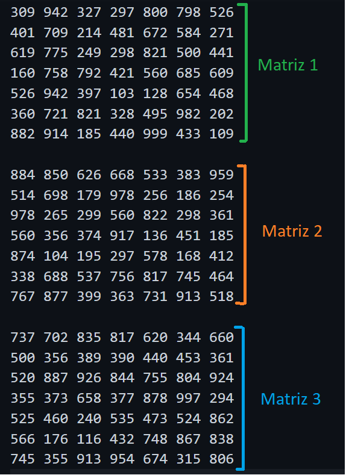
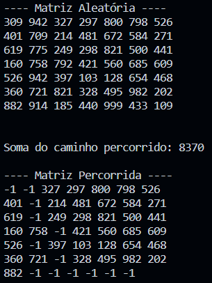

# Proposta do Trabalho

O objetivo do trabalho é caminhar por um conjunto de matrizes fornecidas como entrada, objetivando encontrar o maior valor final segundo um conjunto de regras preestabelecidas.

```REGRAS```

- Criar um sistema que leia K matrizes quadradas no tamanho NxN.

- Seu programa deve enumerá-las, de forma a deixa-las organizadas para processamento. 

- Partindo da primeira matriz, você deve iniciar de um ponto preestabelecido, esse pode ser fornecido pelo usuário ou estar contido em arquivos extras de configuração. Não é permitido definir diretamente no código. 

- A partir da primeira matriz, você tem como regras: (a) avançar para a próxima coluna; (b) retroceder para coluna anterior; (c)  saltar para a linha de baixo; (d) ir em diagonal para baixo. Todas essas regras só se aplicam se a casa (posição i,j da matriz) ainda não tenha sido descoberta ou já processada. 

- Para caminhar você deve sempre optar pelo valor da próxima casa, valor esse que deve ser o maior dentre eles. Caso haja empate entre casas, crie uma regra para adotar sempre uma mesma decisão de caminhamento. 

- Ao alcançar a última linha e coluna da matriz, selecione a próxima matriz e repita todo o processo novamente. Por fim, apresente ao usuário qual foi o caminho adotado e qual a soma obtida do caminho realizado.

# Algoritmo Guloso

Um algoritmo gulos é um tipo de algoritmo que busca encontrar a solução ótima de um problema, fazendo sempre a escolha localmente ótima em cada etapa da solução. Ou seja, em cada passo do algoritmo, ele escolhe a opção mais vantajosa ou a melhor dentre as disponíveis no momento, sem levar em conta o futuro.

No trabalho em si, o algoritmo guloso é utilizado para fazer a verificação de qual lado o algoritmo deve percorrer. Ou seja, segue a ideia de percorrer uma matriz de tamanho NxN a fim de caminhar sempre priorizando os maiores valores obtidos, sem voltar ao caminho percorrido.

</p>

<p align="center">

</p>
<p align="center">
<em>Imagem 1: Esquema de verificação do algoritmo guloso. </em>

</p>

# Input e Output

```INPUT```

A entrada do código consiste em matrizes do tamanho 7x7 que serão lidas e, consequentemente, serão usadas para fazer a verificação do algoritmo guloso.

</p>

<p align="center">

</p>
<p align="center">
<em>Imagem 2: Matrizes utilizadas como exemplo. </em>

</p>

```OUTPUT```

O resultado esperado é de que o caminho seja percorrido, de forma onde é feita a leitura da matriz, ela é tokenizada e, logo após, ela cai dentro da condição de verificação.

</p>

<p align="center">

</p>
<p align="center">
<em>Imagem 3: Resultado da matriz 1. </em>

</p>


# Compilação e Execução

O algoritmo disponibilizado possui um arquivo Makefile que realiza todo o procedimento de compilação e execução. Para tanto, temos as seguintes diretrizes de execução:

<div>

| Comando                |  Função                                                                                           |
| -----------------------| ------------------------------------------------------------------------------------------------- |
|  `make clean`          | Apaga a última compilação realizada contida na pasta build                                        |
|  `make`                | Executa a compilação do programa utilizando o gcc, e o resultado vai para a pasta build           |
|  `make run`            | Executa o programa da pasta build após a realização da compilação                                 |

</div>

# Contato

<div>
<p align="justify"> Eduardo da Silva Torres Grillo </p>
<a href="https://t.me/eduardogrilloo">
 
</div>
